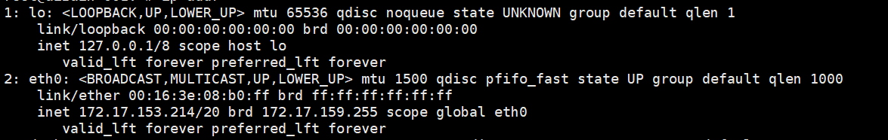

# IP地址

版本 v20190409

## 1 什么是IP地址

### 1.1 维基说法

互联网协议地址（英语：Internet Protocol Address，又译为网际协议地址）缩写为IP地址（英语：IP Address），
是分配给网络上使用网际协议（英语：Internet Protocol, IP）的设备的数字标签

### 1.2 简单说法

- 互联网 = 地球
- IP地址 = 住址
- IP地址是一个网卡在网络世界的通讯地址，相当于现实世界的门牌号

## 2 为什么要了解IP地址

1. 你是否需要使用Linux/Windows查看IP，网卡信息都描述了什么？
2. 技术面试，网络知识的基石。
3. 你可能知道A、B、C类网络，那你知道CIDR吗？

## 3 先来看看如何查询IP地址

### 3.1 两个小问题

```
1. Linux处理用ifconfig查看ip，是否还有别的命令？
2. ifconfig是Linux自带的系统命令吗？
```

`答案:`
```
1. Linux还可以并建议使用 ip addr 来查看IP，ifconfig属于旧命令，已不再维护了
2. Linux上的ifconfig是net-tools软件包的一部分，ip addr是iproute2软件包的一部分
```

Please keep in mind that most net-tools programs are obsolete now:

| program	| obsoleted by |
| - | - |
| arp | ip neigh |
| ifconfig | ip addr |
| ipmaddr | ip maddr |
| iptunnel | ip tunnel |
| route | ip route |
| nameif | ifrename |
| mii-tool | ethtool |

### 3.2 命令使用及效果

- Windows
  - ipconfig
- Linux
  - ifconfig
  - ip addr




在查看服务器网卡时，每次都能看到如上信息，那么其中的 `inet 172.17.153.214/20 brd 172.17.159.255` 里面的IP是如何划分的？其中的 `/20` 又是什么呢？广播地址是怎么算出来的呢？

## 4 IP五大基本分类

| 类型	| IP段 | 网络数 | 主机数 | 私有IP段 | 子网掩码 |
| - | - | - | - | - | - |
| A类 | 0.0.0.0-127.255.255.255 | 128 | 16777214 | 10.0.0.0-10.255.255.255 | 255.0.0.0 |
| B类 | 128.0.0.0-191.255.255.255 | 16384 | 65534 | 172.16.0.0-172.31.255.255 | 255.255.0.0 |
| C类 | 192.0.0.0-223.255.255.255 | 2097152 | 254 | 192.178.0.0-192.168.255.255 | 255.0.0.0 |
| D类 | 224.0.0.0-239.255.255.255 | 组播地址 |  |  |  |
| E类 |  | 保留地址 |  |  |  |