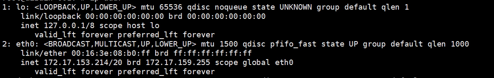

# IP地址基础

版本 v20190410

## 1 什么是IP地址

### 1.1 维基说法

互联网协议地址（英语：Internet Protocol Address，又译为网际协议地址）缩写为IP地址（英语：IP Address），
是分配给网络上使用网际协议（英语：Internet Protocol, IP）的设备的数字标签

### 1.2 简单说法

- 互联网 = 地球
- IP地址 = 住址
- IP地址是一个网卡在网络世界的通讯地址，相当于现实世界的门牌号

## 2 为什么要了解IP地址

1. 你是否需要使用Linux/Windows查看IP，网卡信息都描述了什么？
2. 技术面试，网络知识的基石。
3. 你可能知道A、B、C类网络，那你知道CIDR吗？

## 3 先来看看如何查询IP地址

### 3.1 两个小问题

```
1. Linux处理用ifconfig查看ip，是否还有别的命令？
2. ifconfig是Linux自带的系统命令吗？
```

`答案:`
```
1. Linux还可以并建议使用 ip addr 来查看IP，ifconfig属于旧命令，已不再维护了
2. Linux上的ifconfig是net-tools软件包的一部分，ip addr是iproute2软件包的一部分
```

Please keep in mind that most net-tools programs are obsolete now:

| program	| obsoleted by |
| - | - |
| arp | ip neigh |
| ifconfig | ip addr |
| ipmaddr | ip maddr |
| iptunnel | ip tunnel |
| route | ip route |
| nameif | ifrename |
| mii-tool | ethtool |

### 3.2 命令使用及效果

- Windows
  - ipconfig
- Linux
  - ifconfig
  - ip addr




在查看服务器网卡时，每次都能看到如上信息，那么其中的 `inet 172.17.153.214/20 brd 172.17.159.255` 里面的IP是如何划分的？其中的 `/20` 又是什么呢？广播地址是怎么算出来的呢？

## 4 IP五大基本分类

| 类型	| IP段 | 网络数 | 主机数 | 私有IP段 | 子网掩码 |
| - | - | - | - | - | - |
| A类 | 0.0.0.0-127.255.255.255 | 128 | 16777214 | 10.0.0.0-10.255.255.255 | 255.0.0.0 |
| B类 | 128.0.0.0-191.255.255.255 | 16384 | 65534 | 172.16.0.0-172.31.255.255 | 255.255.0.0 |
| C类 | 192.0.0.0-223.255.255.255 | 2097152 | 254 | 192.178.0.0-192.168.255.255 | 255.0.0.0 |
| D类 | 224.0.0.0-239.255.255.255 | 组播地址 |  |  |  |
| E类 | 240.0.0.0-247.255.255.255 | 保留地址 |  |  |  |

这个是最早的IP分类，当时机器数量都比较少，所以像C类地址，能支持一个网段内的机器只有254个，已经难以支持现在环境下的主机分配了。为了解决网络需求的增长问题，出现 CIDR 无类型域间选路(Classless Inter-Domain Routing) 分类方法以及IPv6。

### 4.1 基础知识

- IPv4
  - 32位
  - 分为4段，每部分8bit
  - 0.0.0.0 - 255.255.255.255
  - 0000 0000 . 0000 0000 . 0000 0000 . 0000 0000
- bit
  - 1位 = 1bit = 0-1
  - 0000 0000
  - 每一位对应10进制数值 128 64 32 16 8 4 2 1
  - 总值 0-255
- IPv6
  - 128位
  - X:X:X:X : X:X:X:X
  - 0000:0000:0000:0000 : 0000:0000:0000:0000 - FFFF:FFFF:FFFF:FFFF : FFFF:FFFF:FFFF:FFFF
  - 可以用双冒号`::`表示一组0或多组连续的0，但只能出现一次
    - 0:0:0:0:0:0:0:0 → ::
    - 0:0:0:0:0:0:0:1 → ::1
- 网络号/主机号
  - 网络号是由一个非营利性的机构来管理的，以避免冲突，该机构的名称为ICANN。同时，ICANN把部分地址空间委托给各种区域性的权威机构，然后这些权威机构又将IP地址分配给ISP和其他的公司
  - 主机号是网络号下，自行分配的主机号
- 公有IP
  - 有组织统一分配，接互联网
- 私有IP
  - 自行分配，不接互联网
  - 常见 192.168.x.x


### 4.2 CIDR

用户自己对于IP地址重新划分的一种方式

- 示例：10.100.122.2/24
  - `10.100.122.2` 是本机IP
  - `/24`就是CIDR标识，表示IP前24位是网络号，后8位是主机号
  - IP/CIDR
  - 广播地址 10.100.122.255
  - 子网掩码 255.255.255.0
    - 主要用于计算两个IP是否是同一网段(网络号)
    - IP地址 & 子网掩码 = 网络号

## 5 来看看Linux的网卡都描述了什么

### 5.1 常见网卡信息如下

```
1: lo: <LOOPBACK,UP,LOWER_UP> mtu 65536 qdisc noqueue state UNKNOWN group default qlen 1
    link/loopback 00:00:00:00:00:00 brd 00:00:00:00:00:00
    inet 127.0.0.1/8 scope host lo
       valid_lft forever preferred_lft forever
2: eth0: <BROADCAST,MULTICAST,UP,LOWER_UP> mtu 1500 qdisc pfifo_fast state UP group default qlen 1000
    link/ether 00:16:3e:08:b0:ff brd ff:ff:ff:ff:ff:ff
    inet 172.17.153.214/20 brd 172.17.159.255 scope global eth0
       valid_lft forever preferred_lft forever
```

### 5.2 网卡信息详解

- `inet` IP/CIDR (172.17.153.214/20)
- `brd` 广播地址
- `scope` 网络范围
  - global 接互联网 valid everywhere
  - host 仅本机 valid only inside this host (machine)
  - site	valid only within this site (IPv6)
  - link	valid only on this device
- `link/ether` MAC地址 (00:16:3e:08:b0:ff)
- <BROADCAST,MULTICAST,UP,LOWER_UP> 网络设备的状态标识 net_deviceflags
  - UP 网卡处于启动状态
  - BROADCAST 网卡有广播地址
  - MULTICAST 网卡可以发送多播包
  - LOWER_UP L1是启动的(网线连着)
- `mtu` 1500
  - 最大传输单位（数据包大小）为1,500字节
  - 以太网默认值 1500
  - 是网络模型第二层MAC层的概念
- `qdisc` pfifo_fast
  - 全称 queueing discipline 排队规则
  - pfifo 不处理进入数据包
  - pfifo_fast 三个波段(band)
    - 优先级 band0 > band1 > band2
    - TOS
      - Type of Service
      - 数据包根据此类型分配到不同band
      - TOS是IP头里的一个字段
- other
  - state UP 网络接口已启用
  - group default 接口组
  - qlen 1000 传输队列长度
  - valid_lft forever IPv6 地址的有效使用期限
  - preferred_lft forever IPv6 地址的首选生存期


## 6 IP计算练习

已知IP `16.158.165.91/22`，计算第一个地址、子网掩码、广播地址

## 7 Continue...

当然还有如下你可能还不明白，请见下回分解~

1. IP如何分配及使用？
2. 组播、广播、回环地址都是干什么的？
3. MAC地址在实际网络环境中，有哪些作用？
4. 什么是以太网？

